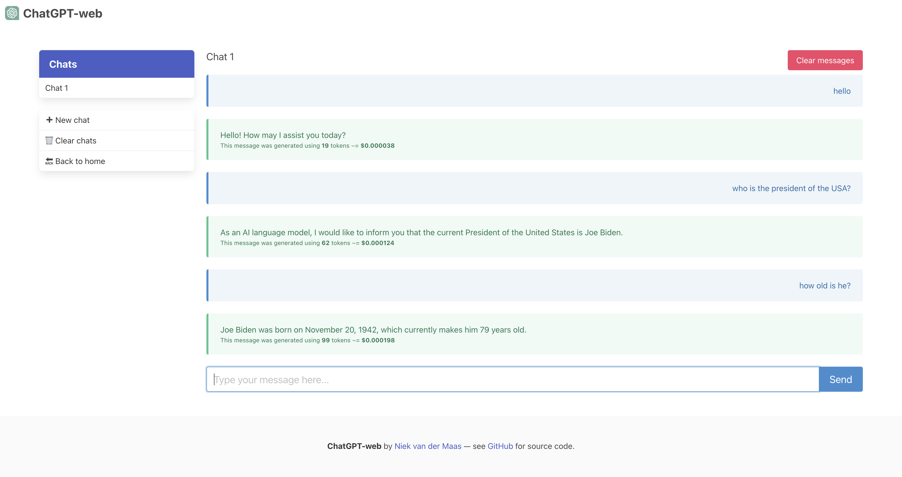

# ChatGPT-web
[](https://github.com/Niek/chatgpt-web/actions/workflows/pages.yml)
[](https://standardjs.com)
[](/LICENSE)
[](#contributors)

## **URL**: https://niek.github.io/chatgpt-web/




ChatGPT-web is a simple one-page web interface to the OpenAI ChatGPT API. To use it, you need to register for [an OpenAI API key](https://platform.openai.com/account/api-keys) first. All messages are stored in your browser's local storage, so everything is **private**. You can also close the browser tab and come back later to continue the conversation.

## Features
* **Open source**: ChatGPT-web is open source ([GPL-3.0](/LICENSE)), so you can host it yourself and make changes as you want.
* **Private**: All chats and messages are stored in your browser's local storage, so everything is private.
* **Customizable**: You can customize the prompt, the temperature, and other model settings. Multiple models (including GPT-4) are supported.
* **Cheaper**: ChatGPT-web uses the commercial OpenAI API, so it's much cheaper than a ChatGPT Plus subscription.
* **Fast**: ChatGPT-web is a single-page web app, so it's [fast and responsive](https://pagespeed.web.dev/analysis/https-niek-github-io-chatgpt-web/8xv5uwrnes).
* **Mobile-friendly**: ChatGPT-web is mobile-friendly, so you can use it on your phone.
* **Voice input**: ChatGPT-web supports voice input, so you can talk to ChatGPT. It will also talk back to you.
* **Pre-selected prompts**: ChatGPT-web comes with a list of [pre-selected prompts](https://github.com/f/awesome-chatgpt-prompts), so you can get started quickly.
* **Export**: ChatGPT-web can export chats as a Markdown file, so you can share them with others.
* **Code**: ChatGPT-web recognizes and highlights code blocks and allows you to copy them with one click.
* **Desktop app**: ChatGPT-web can be bundled as a desktop app, so you can use it outside of the browser.
* **Image generation**: ChatGPT-web can generate images using the DALL·E model by using the prompt "show me an image of ...".
* **Streaming**: ChatGPT-web can stream the response from the API, so you can see the response as it's being generated.

## Development

To run the development server, run

```bash
npm ci
npm run dev # or: npm run build
```

To update the [`awesome-chatgpt-prompts`](/src/awesome-chatgpt-prompts/) subtree, run :
```bash
git subtree pull --prefix src/awesome-chatgpt-prompts https://github.com/f/awesome-chatgpt-prompts.git main --squash
```

## Use with Docker compose

```bash
docker compose up -d
```

## Mocked api
If you don't want to wait for the API to respond, you can use the mocked API instead. To use the mocked API, edit the `.env` file at root of the project and set the key `VITE_API_BASE=http://localhost:5174` in it. Then, run the `docker compose up -d` command above.

You can customize the mocked API response by sending a message that consists of `d` followed by a number, it will delay the response the the specified number of seconds. You can customize the length of the response by including `l` followed by a number, it will return a response with the specified number of sentences.
For example, sending the message `d2 l10` will result in a 2 seconds delay and 10 sentences response.

## Desktop app

You can also use ChatGPT-web as a desktop app. To do so, [install Rust first](https://www.rust-lang.org/tools/install). Then, simply run `npm run tauri dev` for the development version or `npm run tauri build` for the production version of the desktop app. The desktop app will be built in the `src-tauri/target` folder.

## Contributors

<!-- ALL-CONTRIBUTORS-LIST:START - Do not remove or modify this section -->
<!-- prettier-ignore-start -->
<!-- markdownlint-disable -->
<table>
  <tbody>
    <tr>
      <td align="center" valign="top" width="14.28%"><a href="https://github.com/Michael-Tanzer"><br /><sub><b>Michael Tanzer</b></sub></a><br /><a href="#ideas-Michael-Tanzer" title="Ideas, Planning, & Feedback">🤔</a> <a href="https://github.com/Niek/chatgpt-web/commits?author=Michael-Tanzer" title="Code">💻</a></td>
      <td align="center" valign="top" width="14.28%"><a href="https://github.com/petergeneric"><br /><sub><b>Peter</b></sub></a><br /><a href="#ideas-petergeneric" title="Ideas, Planning, & Feedback">🤔</a></td>
      <td align="center" valign="top" width="14.28%"><a href="https://danb.me"><br /><sub><b>Dan Brown</b></sub></a><br /><a href="#ideas-ssddanbrown" title="Ideas, Planning, & Feedback">🤔</a> <a href="https://github.com/Niek/chatgpt-web/commits?author=ssddanbrown" title="Code">💻</a></td>
      <td align="center" valign="top" width="14.28%"><a href="https://github.com/littlemoonstones"><br /><sub><b>littlemoonstones</b></sub></a><br /><a href="https://github.com/Niek/chatgpt-web/commits?author=littlemoonstones" title="Code">💻</a> <a href="#ideas-littlemoonstones" title="Ideas, Planning, & Feedback">🤔</a></td>
      <td align="center" valign="top" width="14.28%"><a href="https://github.com/maxrye1996"><br /><sub><b>maxrye1996</b></sub></a><br /><a href="https://github.com/Niek/chatgpt-web/issues?q=author%3Amaxrye1996" title="Bug reports">🐛</a></td>
      <td align="center" valign="top" width="14.28%"><a href="https://github.com/Mikemansour"><br /><sub><b>Mikemansour</b></sub></a><br /><a href="#ideas-Mikemansour" title="Ideas, Planning, & Feedback">🤔</a></td>
      <td align="center" valign="top" width="14.28%"><a href="https://github.com/abc91199"><br /><sub><b>abc91199</b></sub></a><br /><a href="#ideas-abc91199" title="Ideas, Planning, & Feedback">🤔</a></td>
    </tr>
    <tr>
      <td align="center" valign="top" width="14.28%"><a href="https://github.com/fuegovic"><br /><sub><b>fuegovic</b></sub></a><br /><a href="#ideas-fuegovic" title="Ideas, Planning, & Feedback">🤔</a></td>
      <td align="center" valign="top" width="14.28%"><a href="https://www.liuin.cn"><br /><sub><b>Sixzeroo</b></sub></a><br /><a href="https://github.com/Niek/chatgpt-web/commits?author=Sixzeroo" title="Code">💻</a></td>
      <td align="center" valign="top" width="14.28%"><a href="http://terryoy.github.io/"><br /><sub><b>terryoy</b></sub></a><br /><a href="#ideas-terryoy" title="Ideas, Planning, & Feedback">🤔</a> <a href="https://github.com/Niek/chatgpt-web/commits?author=terryoy" title="Code">💻</a></td>
      <td align="center" valign="top" width="14.28%"><a href="https://www.linkedin.com/in/yang-lyu-902/"><br /><sub><b>Yang Lyu</b></sub></a><br /><a href="https://github.com/Niek/chatgpt-web/issues?q=author%3Ayanglyu902" title="Bug reports">🐛</a></td>
      <td align="center" valign="top" width="14.28%"><a href="https://github.com/ryanhex53"><br /><sub><b>ryanhex53</b></sub></a><br /><a href="https://github.com/Niek/chatgpt-web/commits?author=ryanhex53" title="Code">💻</a> <a href="#design-ryanhex53" title="Design">🎨</a></td>
      <td align="center" valign="top" width="14.28%"><a href="https://github.com/shivan2418"><br /><sub><b>Emil Elgaard</b></sub></a><br /><a href="#ideas-shivan2418" title="Ideas, Planning, & Feedback">🤔</a> <a href="#design-shivan2418" title="Design">🎨</a> <a href="https://github.com/Niek/chatgpt-web/commits?author=shivan2418" title="Code">💻</a></td>
      <td align="center" valign="top" width="14.28%"><a href="https://github.com/felixschwamm"><br /><sub><b>felixschwamm</b></sub></a><br /><a href="https://github.com/Niek/chatgpt-web/commits?author=felixschwamm" title="Code">💻</a> <a href="#ideas-felixschwamm" title="Ideas, Planning, & Feedback">🤔</a></td>
    </tr>
    <tr>
      <td align="center" valign="top" width="14.28%"><a href="https://github.com/Webifi"><br /><sub><b>Webifi</b></sub></a><br /><a href="https://github.com/Niek/chatgpt-web/commits?author=Webifi" title="Code">💻</a> <a href="#ideas-Webifi" title="Ideas, Planning, & Feedback">🤔</a></td>
      <td align="center" valign="top" width="14.28%"><a href="https://github.com/Madrawn"><br /><sub><b>Daniel Dengler</b></sub></a><br /><a href="https://github.com/Niek/chatgpt-web/commits?author=Madrawn" title="Code">💻</a></td>
      <td align="center" valign="top" width="14.28%"><a href="http://ashkanph.github.io"><br /><sub><b>Ashkan</b></sub></a><br /><a href="https://github.com/Niek/chatgpt-web/commits?author=Ashkanph" title="Code">💻</a></td>
      <td align="center" valign="top" width="14.28%"><a href="https://github.com/antopoid"><br /><sub><b>antopoid</b></sub></a><br /><a href="https://github.com/Niek/chatgpt-web/commits?author=antopoid" title="Documentation">📖</a></td>
    </tr>
  </tbody>
</table>

<!-- markdownlint-restore -->
<!-- prettier-ignore-end -->

<!-- ALL-CONTRIBUTORS-LIST:END -->
